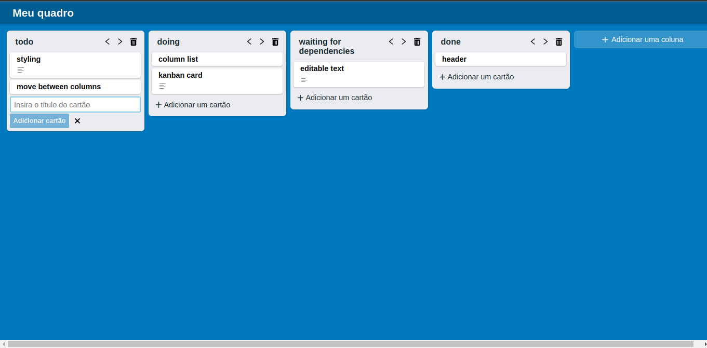

# React Kanban App

Um quadro Kanban desenvolvido com React e Redux.

---

## Veja você mesmo :globe_with_meridians:

Acesse o deploy da aplicação nesse link:

### www.deploy.com

## O projeto 💻

A aplicação permite que o usuário crie e organize seu quadro kanban. É possível definir o título do quadro, criar, renomear, mover e apagar colunas. Também é possível criar, renomear e mover os cartões entre as colunas.

Todas as informações são gerenciadas globalmente através da biblioteca Redux Toolkit e salvas e recuperadas do local storage.

## Tecnologias utilizadas ⚙️

- React
- Redux Toolkit
- React Icons
- CSS Modules

## Futuros passos 🔮

Esse projeto ainda não está finalizado e há muito o que melhorar. Algumas funcionalidades que serão implementadas futuramente são:

- ### Drag and drop

  A possibilidade de mover livremente as colunas e cartões, substituíndo os botões

- ### Tags

  Etiquetas de fácil visualização que categorizem os cartões como importâncias, identificadas por cores diferentes.

- ### Migração do Redux Toolkit para Context API
